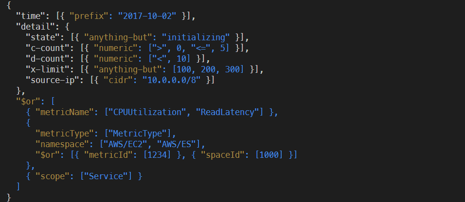

# tree-sitter-eventrule

Grammar for AWS Event Rules:
https://docs.aws.amazon.com/eventbridge/latest/userguide/eb-event-patterns-content-based-filtering.html



## `rule2rego` utility

This utility is shipped with the npm package and is a small compiler that makes
OPA REGO policies from AWS Event Rule patterns.

```bash
$ npm install -g tree-sitter-eventrule
$ rule2rego --help
Compiles AWS Event Rule pattern JSON to OPA REGO policy.
Usage: rule2rego <rule>.json
```

## adding e2e compiler tests

If you want to run the tests locally, you need to have:

- Docker for Tree Sitter to build you a `.wasm` artifact
- OPA for Jest to build you `.wasm` policies for evaluation

Jest picks up your tests automatically if you follow these instructions:

- Add your rule JSON `<rule name>.json` under `test/fixtures`
- With the same name, create a directory `<rule name>`
- Create two additional directories `allows` and `denies` inside it
- Any JSON you put in either of those two folders, is picked as an event JSON

`npm test` output is sorted alphabetically.

Sample directory structure:

```raw
- test/fixtures
  - prefix-matching.json
  - prefix-matching
    - allows
      - event1.json
      - event2.json
    - denies
      - event1.json
      - event2.json
```
